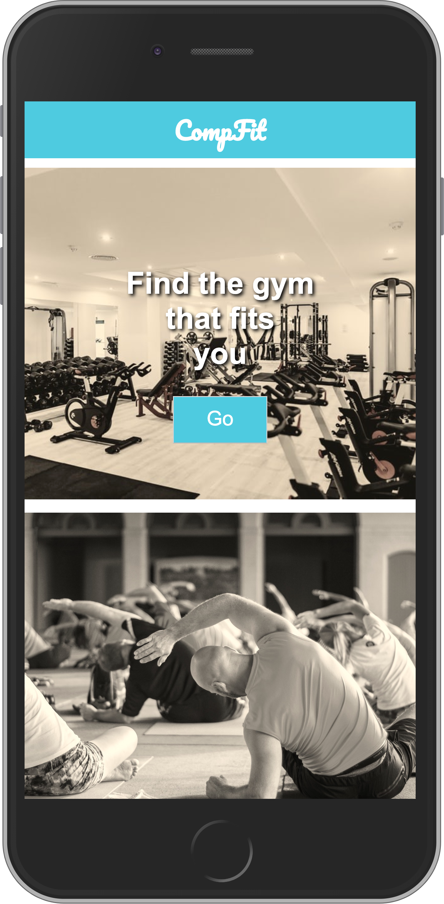

# Compfit

Find the gym that fits you by using different filter-options.  
Want to know which Gym doesn't bound you for two years? Select the flexx-Option.  
It comes better: Want to have a gym with dynamic contract-terms and one that has wellnes opportunities you looking for. Perfect! Select this option and don't waste your time with hard research to figure out which gym fits YOU !

## How to Initialize and Start

1. Install dependcies with  
   `npm install`  
   Install JSON-Webserver  
   `npm install -g json-server`

2. Run the app with  
   `npm start` 
   and  
   `json-server --watch db.json`

### Miscellaneous

- This app is not commercial
- The used data contains mocking data
- The app was developed as part of an Coding-Bootcamp at neuefische GmbH
- This app uses an MIT License

## Screenshots

